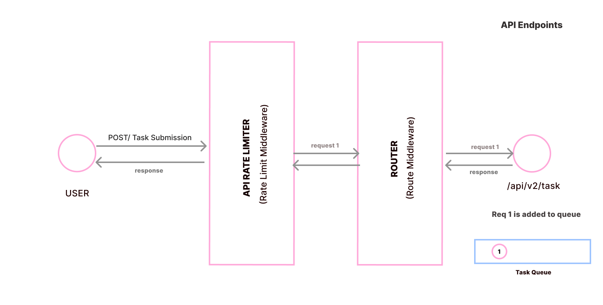
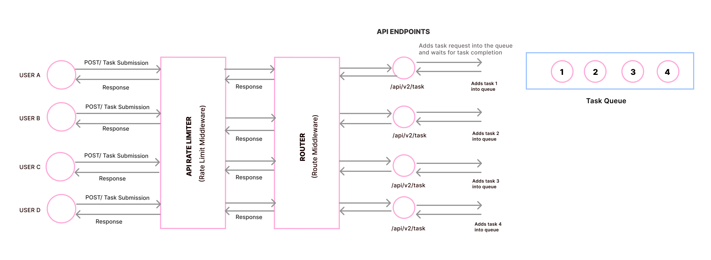
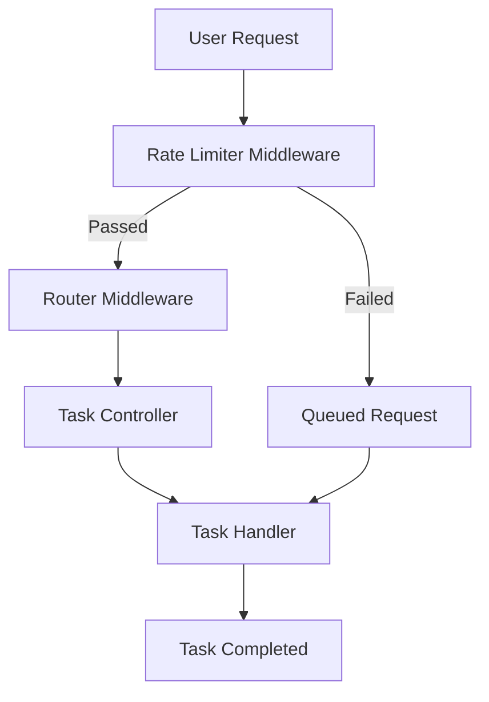

**_User Task Queuing with Rate Limiting_**

# Overview

### Purpose

This service processes user tasks in a queue with rate limiting to handle high traffic. API rate limiting restricts user requests, allowing a user to make:

- 1 request per second
- 20 requests per minute

If the rate limit is exceeded, those requests are queued into the `taskQueue`. These requests are processed after all the previous tasks in the queue are completed.

### Features

- Rate limiting
- Queuing tasks with Bull
- Unique user job IDs
- Task-handling techniques like debouncing or deduplication
- The application uses two replica sets of Node instances to efficiently handle high traffic and ensure high availability.

# Setup and Installation Guide

## Prerequisites

Before you begin, ensure you have the following installed on your system:

- **Node.js** (v12 or higher recommended)
- **npm** (Node package manager, usually comes with Node.js)
- **Redis** (In-memory data store for caching and task queuing)

## Dependencies

Below is a list of key dependencies used in the project:

```json
"dependencies": {
  "bull": "^4.16.4",
  "dotenv": "^16.4.5",
  "express": "^4.21.1",
  "rate-limit-redis": "^4.2.0",
  "rate-limiter-flexible": "^5.0.4",
  "redis": "^4.7.0"
}
```

## Description of Dependencies

- **bull** : Used for queuing user tasks.
- **dotenv** : Manages environment variables.
- **express** : Provides routing functionality for building web applications.
- **rate-limit-redis** , **rate-limiter-flexible**: Used for Redis-based rate limiting, tracking how frequently a user hits the routes.
- **redis** : Manages data caching.

## Replica set

we have to install pm2 package globally.
`npm install -g pm2`
. After instaling the library
`pm2 start app.js -i 2`

- The -i 2 flag specifies that you want to create two instances of the app.
- PM2 will automatically balance the load between these instances (in cluster mode).

## Redis Installation for Windows

For Redis installation on Windows, you can download the Redis Windows package from
[Redis for windows](https://github.com/microsoftarchive/redis/releases).

## Redis Client Setup

We've to connect the redis server before making server connection.

```
const Redis = require("redis");
require("dotenv").config();

const redisPort = process.env.REDISPORT || 6379;

// Create Redis client using the new format for redis@4.x
const redisClient = Redis.createClient({
  url: `redis://localhost:${redisPort}`, // Use the URL format to specify connection
});

redisClient.on("connect", () => {
  console.log("Connected to Redis server.");
});

redisClient.on("error", (err) => {
  console.error("Redis error:", err);
});

module.exports = redisClient;

```

### Main Application set up

```
const startServer = async () => {
 try {
   await redisClient.connect();
   app.use("/api/v1", taskRouter());
   app.listen(process.env.PORT || 3010, () =>
     console.log(`server running on port ${process.env.PORT || 3010} `)
   );
 } catch (err) {
   console.log(err);
 }
};
```

# Architecture Design

Here's a detailed explanation of the architecture design for a project implementing user task queuing with API rate limiting and high traffic handling using two replica sets of Node applications:

## 1. Overview of the Architecture

The architecture of this project is built to handle high traffic efficiently, ensure consistent user request processing, and provide high availability using a combination of rate-limiting mechanisms, a task queue system, Redis as a data store, and multiple instances of the Node application. This design allows us to manage load distribution, prevent overwhelming of resources, and maintain a scalable, resilient system.

### High Level Architecture Design:



### Components of the Architecture

**Node.js Application (Replica Sets)** :
The main logic resides in two or more replicas of the Node.js application. Each replica acts as an independent instance capable of processing requests.
These replicas can be load-balanced to ensure incoming traffic is evenly distributed across instances.

**API Rate Limiter** :
Rate limiting ensures no single user or group of users can overwhelm the server by sending too many requests in a short period.
RateLimiterRedis is used to implement rate limiting using Redis as the backend store. This component keeps track of user request counts and enforces limits per second, per minute, etc.

**Redis (Caching and Rate Limiting Store)** :
Redis serves as a fast, in-memory data store used for rate limiting, caching, and queuing operations.
It allows for quick retrieval and update of request counters, thus providing an efficient way to throttle excessive requests and cache frequent responses.

**Task Queue (e.g., Bull)**:
Incoming requests that pass through the rate limiter are added to a task queue.
The task queue ensures requests are processed in an orderly manner without overwhelming the server, even if there are bursts of incoming traffic.
A queue processing system picks up tasks from the queue for processing asynchronously

### Here's a High level overview:

- **High-Level Overview**:
  When a user hits an API endpoint, the request first goes through an API rate limiter, which checks if the request adheres to the defined rate limits. If the request passes the checks, it proceeds to the controller.

- **Controller Handling**:
  The controller adds the request to a taskQueue. Whenever there is data in the queue, the task handler immediately picks up the data and begins processing it. Upon successful completion of the task, the taskQueue returns a promise indicating that the job is finished using job.finished(). The controller waits for this promise to be resolved before responding back to the client.

- **Task Queue** :
  If another user hits the same endpoint while the previous request is still being processed, the current user's request will be added to the queue and will wait until the previous request is completed. The taskQueue processes requests one at a time. Once a request is finished, it sends a promise indicating completion, then picks the next request from the queue and begins processing it.

### Control Flow



**Incoming User Request to API Endpoint**:

- As you can see from the picture, we've different layers. Each layer represents each middleware. Here we've API rate limiter and API Router. These two are middlewares.
- The rate limit middleware comes before the route layer. It will intercept and check how frequently a user hits an API endpoint to apply rate limiting logic. Once the rate limit check is complete, and if the request is allowed, the request will proceed to the route layer where the appropriate controller is invoked. This ensures that rate limiting is enforced before any routing logic takes place.

- If any user hits the api endpoint more than limit, that user request is queued and processed.

**Task Controller**:

- Purpose: To add the user request into the taskQueue and once they are finished, it will send response to the client.
- Flow:
  Receives the user request passed through the rate limiter.
  adds the user task into the task queue.
  Control Waiting for Task Completion:
  The controller waits for the task handler to complete processing before proceeding (e.g., using await if asynchronous).
  Ensures tasks are processed one at a time, avoiding concurrent execution for the same user.

- **Task Queue Management (Background Process)**:
  If a task is queued due to rate limiting
  The task queue ensures tasks are handled in a controlled manner.
  Tasks are dequeued and processed sequentially by the taskHandler.

**Task Handler Execution**:

- Purpose:
  To perform the actual user task (e.g., processing a data operation).
  Example: If the task is a time-consuming operation, it uses asynchronous processing (e.g., a setTimeout mock).
  Upon task completion, a response is sent, indicating the task's completion.

### Flow Diagram


